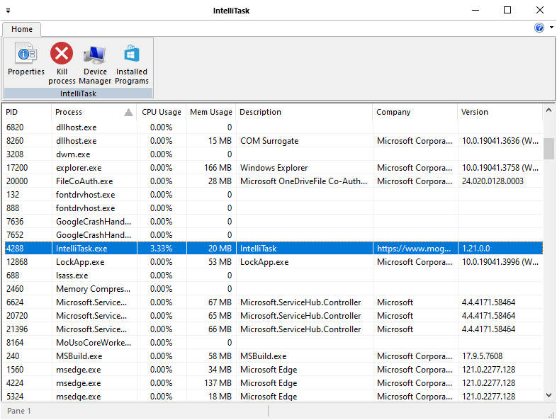

Download:
- [IntelliTaskSetup.msi](https://www.moga.doctor/freeware/IntelliTaskSetup.msi)
- [IntelliTask.zip](https://www.moga.doctor/freeware/IntelliTask.zip)

## Introduction

_IntelliTask_ is a free (as in “free speech” and also as in “free beer”) process/service manager. Running in the Microsoft Windows environment, its use is governed by [GNU General Public License v3.0](https://www.gnu.org/licenses/gpl-3.0.html). _IntelliTask_ is written in C++ and uses pure Win32 API and STL which ensures a higher execution speed and smaller program size. By optimizing as many routines as possible without losing user friendliness, _IntelliTask_ is trying to reduce the world carbon dioxide emissions. When using less CPU power, the PC can throttle down and reduce power consumption, resulting in a greener environment. I hope you enjoy _IntelliTask_ as much as I enjoy coding it!

_IntelliTask_ provides information about processes and services running on your computer. It also displays the most commonly used performance measures for processes. You can use _IntelliTask_ to monitor key indicators of your computer’s performance. You can see the status of the programs that are running and end programs that have stopped responding. You can also assess the activity of running processes using as many as fifteen parameters, and see graphs and data on CPU and memory usage. In addition, if you are connected to a network, you can view network status and see how your network is functioning.

## Getting started

### Install IntelliTask using the installer

- Download the installer
- Run the executable binary and follow the installation flow

The installer will likely require Administrative privileges in order to install _IntelliTask_ (and later, to update _IntelliTask_ or install or update plugins, or anything else that requires writing to the installation directory). If you do not have Administrative privileges, you either need to tell the installer to use a location where you do have write permission (though that may still ask for Administrator privileges), or you may choose not use the installer and instead run a portable edition from a directory where you have write permission.

### Install IntelliTask from zip

These instructions will allow you to run a portable or mini-portable (also called “minimalist”), without requiring administrative privileges.

- Create a new folder somewhere that you have write-permission
- Unzip the content into the new folder
- Run _IntelliTask_ from the new folder

The portable zip edition of _IntelliTask_ can be removed by deleting the directory they came in. If you manually set up file associations or context-menu entries in the OS, it is your responsibility to remove them yourself.

## Application's menu

The  _IntelliTask_  menu features the application's most important functions:

- **Properties**: Shows file properties.
- **Kill process**: Kills selectedd process.
- **Device Manager**: Shows local computer devices.
- **Installed Programs**: Shows computer installed programs.

## Create and Submit your Pull Request

As noted in the [Contributing Rules](https://github.com/mihaimoga/IntelliTask/blob/main/CONTRIBUTING.md) for _IntelliTask_, all Pull Requests need to be attached to a issue on GitHub. So the first step is to create an issue which requests that the functionality be improved (if it was already there) or added (if it was not yet there); in your issue, be sure to explain that you have the functionality definition ready, and will be submitting a Pull Request. The second step is to use the GitHub interface to create the Pull Request from your fork into the main repository. The final step is to wait for and respond to feedback from the developers as needed, until such time as your PR is accepted or rejected.

## Acknowledges

This open source project uses the following libraries:

- [genUp4win](https://github.com/mihaimoga/genUp4win)
- PJ Naughter's [CHLinkCtrl](https://www.naughter.com/hlinkctrl.html)
- PJ Naughter's [CInstanceChecker](https://www.naughter.com/sinstance.html)
- PJ Naughter's [CVersionInfo](https://www.naughter.com/versioninfo.html)
- PJ Naughter's [DtWinVer](https://www.naughter.com/dtwinver.html)
- Mizan Rahman's [CWndResizer](https://www.codeproject.com/Articles/125068/MFC-C-Helper-Class-for-Window-Resizing)
